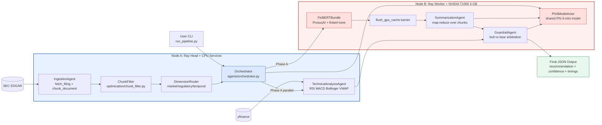

# Diagram 1: High-Level System Architecture

This diagram presents the full two-node architecture of the MAOR-Equity pipeline.
Node A hosts orchestration, SEC ingestion, chunk filtering, and technical indicators.
Node B hosts GPU inference: FinBERT sentiment, Phi-3 summarization, and guardrail arbitration.
The design intentionally serializes GPU phases after `flush_gpu_cache()` to stay within the 4 GB T1000 limit.
Ray object references are used for inter-node data exchange and execution control.

Key design decisions:
- Split CPU-heavy orchestration and data prep (Node A) from GPU-heavy inference (Node B).
- Keep `SummarizationAgent` and `GuardrailAgent` on a shared `Phi3ModelActor` to avoid duplicate model memory.
- Enforce Phase A -> flush -> Phase B to prevent GPU OOM during mixed-model execution.
