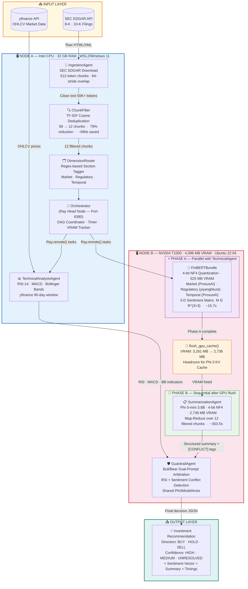

# Diagram 1: High-Level System Architecture

**Description:**
Two-node heterogeneous cluster processing SEC EDGAR filings through a distributed NLP pipeline.
Node A (CPU) handles ingestion, chunk filtering, and orchestration via the Ray head node.
Node B (GPU T1000 4GB) runs all three model-inference phases: FinBERT, Phi-3-mini, and Guardrail.
Phase serialization (`flush_gpu_cache()`) between Phase A and Phase B prevents VRAM OOM (peak: 3,261 MB < 4,096 MB budget).
The ChunkFilter is the dominant performance contributor — 79% chunk reduction saves ~690s per run.

---

---

**Key Performance Numbers:**

| Metric | Value |
|--------|-------|
| End-to-end speedup (H1) | **1.72×** vs B1 serial baseline |
| Task parallelism alone (Amdahl) | 1.019× (p = 0.038) |
| ChunkFilter savings | ~690s · 79% chunk reduction |
| Peak VRAM usage | 3,261 MB / 4,096 MB budget |
| VRAM headroom | 835 MB |
