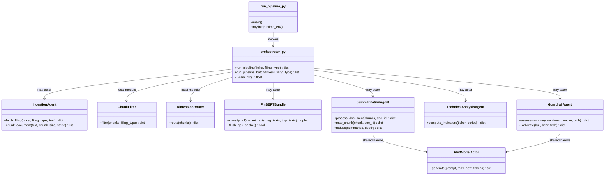

# Diagram 2: Component / Module Diagram

This component view maps the main Python modules and actor relationships in the current codebase.
It emphasizes interface-level dependencies rather than infrastructure, making it useful for design reviews.
The orchestrator is the control plane; all agents remain specialized and loosely coupled.
The most important decision is a shared `Phi3ModelActor` used by both summarization and guardrail paths.

Key design decisions:
- Keep orchestration logic centralized in `agents/orchestrator.py` for deterministic phase control.
- Use small, purpose-built actors with explicit responsibilities to reduce coupling.
- Reuse the same Phi-3 actor across downstream modules to optimize VRAM and startup overhead.
