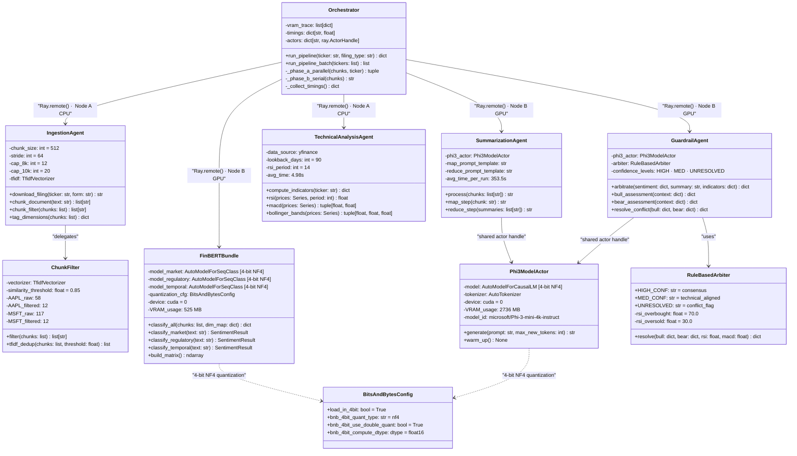

# Diagram 2: Component / Module Diagram

**Description:**
Illustrates the internal structure of each agent module and their typed interfaces.
Every agent is a persistent Ray Actor — initialized once per run, reused across batch tickers.
The Orchestrator holds remote references to all actors and drives the Phase A → flush → Phase B DAG.
SummarizationAgent and GuardrailAgent share a single `Phi3ModelActor` to eliminate duplicate model loading (~2,736 MB saved).
`BitsAndBytesConfig` (4-bit NF4 + double quantization) is the shared quantization strategy across all GPU actors.

---

---

**Actor Placement Summary:**

| Actor | Node | Resource | VRAM |
|-------|------|----------|------|
| IngestionAgent | Node A | CPU | — |
| TechnicalAnalysisAgent | Node A | CPU | — |
| FinBERTBundle | Node B | GPU (cuda:0) | 525 MB |
| SummarizationAgent | Node B | GPU (cuda:0) | shared via Phi3ModelActor |
| GuardrailAgent | Node B | GPU (cuda:0) | shared via Phi3ModelActor |
| **Phi3ModelActor** (shared) | Node B | GPU (cuda:0) | **2,736 MB** |
