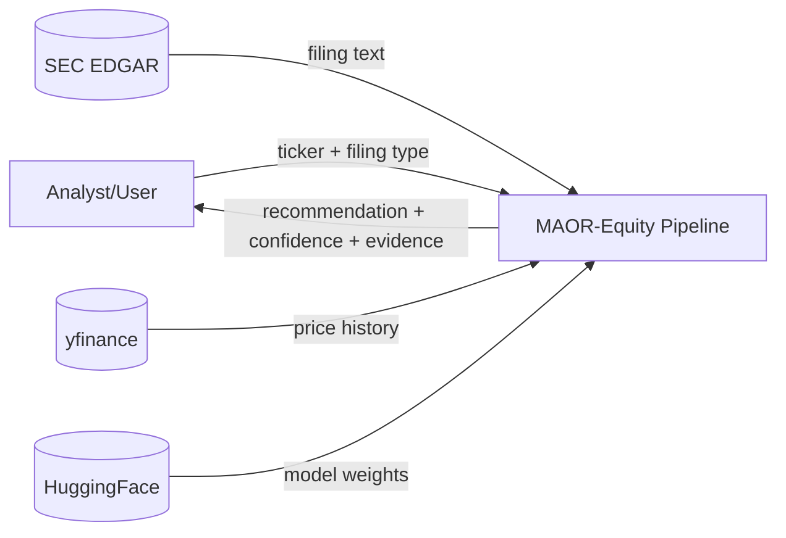
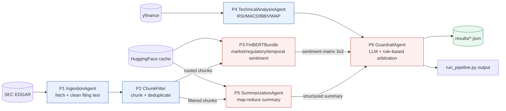

# Diagram 3: Data Flow Diagram (DFD)

This DFD explains how information moves and transforms from external data sources to the final recommendation.
It separates processes from data stores, making traceability and verification straightforward.
The central fusion stage combines three artifact types: sentiment matrix, summary, and technical indicators.
The output is a structured JSON object persisted to logs and returned to the CLI.

## Level 0: Context

## Level 1: Process Flow

Key design decisions:
- Keep chunk filtering before GPU stages to reduce inference cost and latency.
- Treat sentiment, summary, and technical analytics as independent evidence streams.
- Persist decision artifacts to `results` and `logs` for reproducibility and evaluation.
