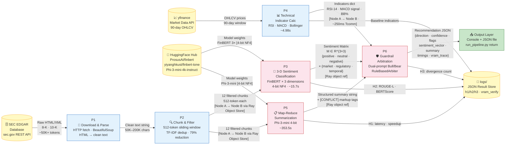
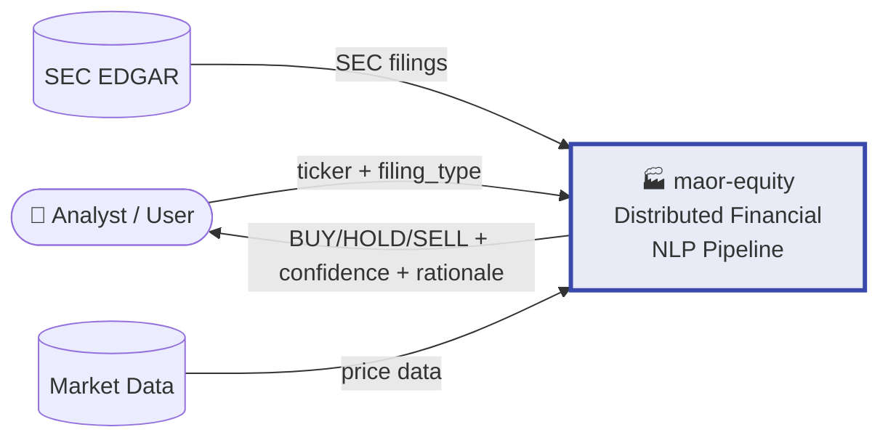

# Diagram 3: Data Flow Diagram (Level 1 DFD)

**Description:**
Shows how data transforms as it moves through the pipeline — from raw SEC filing to final recommendation.
Each process node represents a stateless transformation: raw HTML → clean tokens → filtered chunks → sentiment matrix → summary → decision.
Cross-node Ray transfers carry NumPy arrays and JSON dicts (not raw text) — ~80% bandwidth reduction vs naive string transfer.
The 3×3 sentiment matrix `M[dimension][polarity]` is the central NLP artifact consumed by the GuardrailAgent.
All intermediate results are stored to `logs/` as JSON for hypothesis validation and auditability.

---

---

## Level 0 — Context Diagram

---

**Data Transformation Summary:**

| Stage | Input | Output | Size Change |
|-------|-------|--------|-------------|
| P1 Download & Parse | Raw HTML (50K+ tokens) | Clean text string | -30% (HTML stripped) |
| P2 Chunk & Filter | Clean text | 12 × 512-token chunks | **-79%** (TF-IDF dedup) |
| P3 FinBERT | 12 chunks | 3×3 sentiment matrix | → 9 float values |
| P4 Technical | 90-day OHLCV | 3 indicator values | → scalar dict |
| P5 Phi-3-mini | 12 chunks | 1 summary string | Map-reduce compression |
| P6 Guardrail | Matrix + Summary + Indicators | Recommendation JSON | Final decision |
