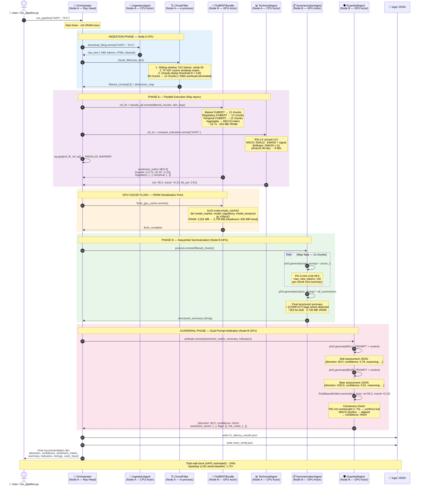

# Diagram 4: Sequence Diagram — End-to-End Pipeline Execution

**Description:**
Shows the full temporal ordering of all agent interactions for a single ticker (e.g., AAPL 8-K filing).
Phase A parallelism is the key distributed computing contribution: FinBERT (Node B GPU) and TechnicalAgent (Node A CPU) execute concurrently via `ray.get([ref_a, ref_b])`.
`flush_gpu_cache()` is the critical synchronization barrier — clears FinBERT KV cache so Phi-3-mini can load without OOM.
The Guardrail's dual-prompt pattern (Bull first, Bear second, then rule-based resolution) is the final decision gate.
Total estimated wall-clock time: ~489s median (AAPL: ~240s, MSFT: ~738s).

---

---

**Timing Breakdown (AAPL Estimated):**

| Phase | Actor | Node | Duration |
|-------|-------|------|----------|
| Ingestion + ChunkFilter | IngestionAgent | A (CPU) | ~45s |
| Phase A: FinBERT (parallel) | FinBERTBundle | B (GPU) | ~15.7s |
| Phase A: Technical (parallel) | TechnicalAgent | A (CPU) | ~4.98s |
| GPU cache flush | FinBERTBundle | B (GPU) | ~2s |
| Phase B: Summarization | SummarizationAgent | B (GPU) | ~353.5s |
| Guardrail arbitration | GuardrailAgent | B (GPU) | ~15s |
| Ray communication overhead | Object Store | A↔B | ~250ms total |
| **Total (AAPL estimated)** | | | **~240s** |
| **B1 Serial baseline (AAPL)** | | | **414.3s** |
| **Speedup** | | | **1.72×** |
