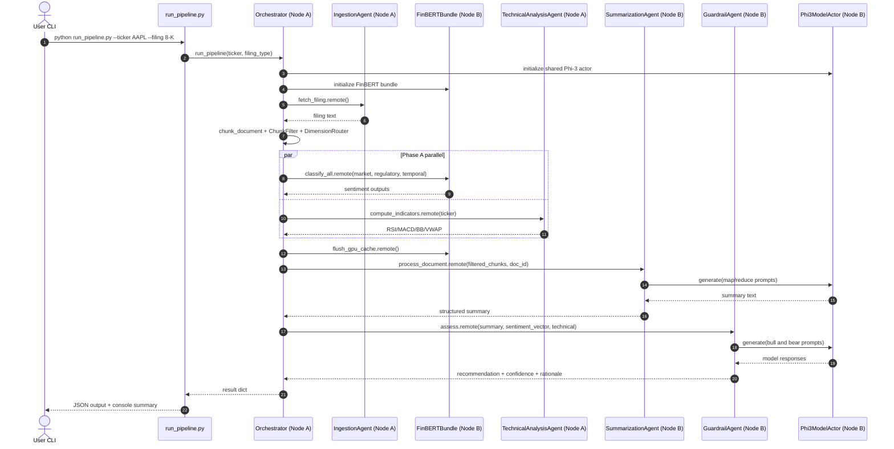

# Diagram 4: Sequence Diagram (Key Process)

This sequence captures one end-to-end execution for a single ticker request.
It highlights control flow, cross-node calls, and synchronization points that protect GPU memory.
The critical architectural pattern is parallel Phase A followed by serialized Phase B.
The result combines all evidence streams into a final guardrail decision object.

Key design decisions:
- Warm up `Phi3ModelActor` before downstream steps to avoid repeated model initialization.
- Execute FinBERT and technical analysis concurrently for latency reduction.
- Flush GPU cache before summarization to maintain stable execution on limited VRAM.
