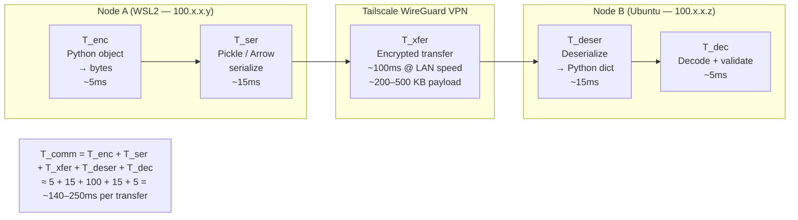

```mermaid
graph TB
    subgraph CLOUD["☁️ External Cloud Services"]
        direction LR
        EDGAR["🏛️ SEC EDGAR API\nsec.gov\nHTTPS REST"]
        HF["🤗 HuggingFace Hub\nProsusAI/finbert\nyiyanghkust/finbert-tone\nPhi-3-mini-4k-instruct\n(cached after first pull)"]
        YF["📈 yfinance API\nmarket data\nHTTPS"]
    end

    subgraph TAILSCALE_VPN["🔒 Tailscale VPN Overlay — 100.x.x.x/24 (WireGuard encrypted)"]
        direction LR

        subgraph NODE_A["🖥️ NODE A — Intel CPU Workstation"]
            direction TB
            subgraph WIN11["Windows 11 Host"]
                PS_MANAGER["⚙️ ray_cluster.ps1\nCluster Manager Script\nStarts WSL2 · monitors health"]
                PS_START["🚀 ray_start_nodeA.ps1\nRay head node launcher"]
            end
            subgraph WSL2["WSL2 — Ubuntu 22.04 (Mirrored Networking)"]
                direction TB
                RAY_HEAD["🎯 Ray GCS Head Node\nPort: 6380 (cluster)\nPort: 8265 (dashboard)\nObject Store: 2 GB"]
                ORC_PROC["📋 Orchestrator Process\norchestrator.py\nrun_pipeline.py entry point"]
                ING_ACTOR["📄 IngestionAgent\n[Ray Actor · CPU]\nsec-edgar-downloader"]
                TA_ACTOR["📊 TechnicalAnalysisAgent\n[Ray Actor · CPU]\nyfinance · pandas · ta-lib"]
                CF_MOD["🔍 ChunkFilter Module\nTF-IDF · scikit-learn\n(in-process, no actor)"]
                PYTHON_ENV["🐍 Python 3.12 venv\nray[default] · transformers\nbitsandbytes · torch-cpu"]
            end
        end

        subgraph NODE_B["🖥️ NODE B — NVIDIA T1000 Workstation"]
            direction TB
            subgraph UBUNTU["Ubuntu 22.04 LTS (Bare Metal)"]
                RAY_WORKER["⚙️ Ray Worker Node\nConnects → 100.x.x.x:6380\nray_start_nodeB.ps1 equivalent"]
                subgraph GPU_ENV["🐍 Python 3.12 venv · CUDA 11.8"]
                    FB_ACTOR["🧠 FinBERTBundle\n[Ray Actor · num_gpus=0.3]\n4-bit NF4 · 525 MB VRAM\nPhase A only"]
                    SUM_ACTOR["📋 SummarizationAgent\n[Ray Actor · num_gpus=0.0]\nDelegates to Phi3ModelActor"]
                    GA_ACTOR["🛡️ GuardrailAgent\n[Ray Actor · num_gpus=0.0]\nDelegates to Phi3ModelActor"]
                    PHI3_ACTOR["🔥 Phi3ModelActor\n[Ray Actor · num_gpus=0.7]\nShared · Persistent Resident\nPhi-3-mini 3.8B 4-bit NF4\n2,736 MB VRAM"]
                end
                subgraph VRAM_LAYOUT["NVIDIA T1000 · 4,096 MB VRAM Budget"]
                    V1["FinBERT (Phase A):  525 MB"]
                    V2["Phi-3-mini (Phase B): 2,736 MB"]
                    V3["KV Cache + Buffers:   ~400 MB"]
                    V4["Ray CUDA overhead:    ~120 MB"]
                    V5["Peak total:          3,261 MB ✅"]
                    V6["Headroom remaining:    835 MB ✅"]
                end
            end
        end

    end

    subgraph STORAGE["💾 Persistent Storage — Node A filesystem"]
        direction LR
        LOGS["logs/\nh1_latency_results.json\nh1_distributed_estimated.json\nh2_rouge_results.json\nh3_sentiment_estimated.json\nvram_verify.json\nconfidence_validation.json"]
        FIGS["figures/\nfig1_latency_comparison.png\nfig2_tcomm_breakdown.png\nfig3_speedup_attribution.png\nfig4_vram_trace.png\nfig5_rouge_comparison.png\nfig6_h3_sentiment.png\nfig7_amdahl.png\nfig8_chunk_filter.png"]
        DATA["data/\nECTSum dataset\nSEC filing cache\nFinancial PhraseBank"]
        PAPER["paper/\nresearch_paper_template.md"]
    end

    EDGAR -->|"HTTPS"| ING_ACTOR
    HF -->|"HTTPS — one-time download\ncached to ~/.cache/huggingface"| FB_ACTOR
    HF -->|"HTTPS — one-time download\ncached to ~/.cache/huggingface"| PHI3_ACTOR
    YF -->|"HTTPS"| TA_ACTOR

    RAY_HEAD <-->|"Tailscale WireGuard\nRay protocol · port 6380\nObject store refs · task scheduling"| RAY_WORKER
    PS_MANAGER -->|"Manages WSL2 lifecycle"| RAY_HEAD
    WIN11 -.->|"WSL2 mirrored networking"| WSL2

    ORC_PROC --> ING_ACTOR
    ORC_PROC --> TA_ACTOR
    ORC_PROC --> FB_ACTOR
    ORC_PROC --> SUM_ACTOR
    ORC_PROC --> GA_ACTOR
    FB_ACTOR -. "Phase A → flush → Phase B" .-> PHI3_ACTOR
    SUM_ACTOR --> PHI3_ACTOR
    GA_ACTOR --> PHI3_ACTOR

    ORC_PROC -->|"writes results"| LOGS
    ORC_PROC -->|"generates plots"| FIGS

    style NODE_A fill:#e3f2fd,stroke:#1565c0,stroke-width:3px
    style NODE_B fill:#fce4ec,stroke:#c62828,stroke-width:3px
    style TAILSCALE_VPN fill:#f3e5f5,stroke:#7b1fa2,stroke-width:2px
    style CLOUD fill:#e8f5e9,stroke:#2e7d32,stroke-width:2px
    style STORAGE fill:#fff8e1,stroke:#f57f17,stroke-width:2px
    style VRAM_LAYOUT fill:#fff3e0,stroke:#e65100,stroke-width:1px
    style GPU_ENV fill:#fce4ec,stroke:#c62828,stroke-width:1px
    style WSL2 fill:#e3f2fd,stroke:#1565c0,stroke-width:1px
    style WIN11 fill:#bbdefb,stroke:#1565c0,stroke-width:1px
```

# Diagram 5: Deployment Diagram

**Description:**
Maps every software component to its physical hardware node in the two-node heterogeneous cluster.
Node A runs WSL2 (Ubuntu 22.04, mirrored networking) inside Windows 11; the Ray head node listens on port 6380.
Node B runs Ubuntu 22.04 bare-metal with NVIDIA T1000 (CUDA 11.8); it joins the cluster as a Ray worker via Tailscale VPN.
Tailscale provides the secure peer-to-peer overlay network (100.x.x.x/24) — eliminates raw LAN routing complexity.
All model weights are downloaded once from HuggingFace Hub and cached locally on Node B (no per-run downloads).

---

---

**Network Architecture — 5-Component Tcomm Model:**

---

**Infrastructure Summary:**

| Component | Node A | Node B |
|-----------|--------|--------|
| OS | Windows 11 + WSL2 (Ubuntu 22.04) | Ubuntu 22.04 LTS (bare metal) |
| CPU | Intel (32 GB RAM) | Intel/AMD (16+ GB RAM) |
| GPU | None (CPU-only) | NVIDIA T1000 (4,096 MB VRAM) |
| CUDA | Not applicable | CUDA 11.8 + cuDNN |
| Ray role | Head node (GCS + scheduling) | Worker node |
| Ray port | 6380 (cluster) · 8265 (dashboard) | Connects → 100.x.x.x:6380 |
| Network | Tailscale 100.x.x.y | Tailscale 100.x.x.z |
| Python | 3.12 · venv · torch-cpu | 3.12 · venv · torch-cu118 |
