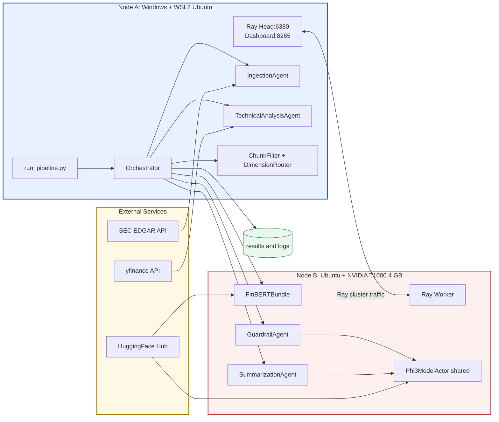

# Diagram 5: Deployment Diagram

This deployment view maps logical services to physical and runtime infrastructure.
It reflects the current two-node Ray setup with Node A as head and Node B as GPU worker.
External APIs remain decoupled through HTTPS, while inter-node scheduling and object exchange use Ray.
The layout highlights where GPU memory pressure is managed through actor placement.

Key design decisions:
- Deploy Ray head on Node A to keep orchestration and ingestion close to the CLI entry point.
- Isolate GPU actors on Node B and centralize LLM use via a shared model actor.
- Keep external dependencies outside cluster internals to simplify scaling and fault isolation.
